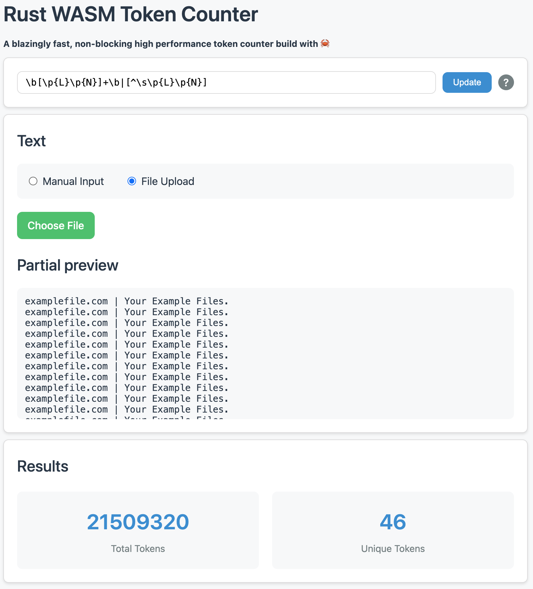

# Rust WebAssembly Token Counter

A high-performance, non-blocking token counter built with Rust and WebAssembly. 
This application efficiently processes text files of any size, providing real-time token counting.

## System Architecture

```
┌─────────────────┐     ┌───────────────┐     ┌────────────────┐
│                 │     │               │     │                │
│  Web Interface  │◄────┤  Web Worker   │◄────┤  Rust/WASM     │
│   (HTML/JS)     │     │  (Bridge)     │     │  Engine        │
└─────────────────┘     └───────────────┘     └────────────────┘
         ▲                     │                      ▲
         │                     │                      │
         │                     ▼                      │
     User Input  ─────────────────────────────────►  Process & Count
                                                     - Token Processing
                                                     - Regex Handling
                                                     - Count Tracking
                                                     - Memory Management
```

The workflow is:
1. User inputs text via direct entry, clipboard paste, or file upload
2. Web worker receives the text and passes it to the Rust WASM module
3. Rust code processes the text in chunks, maintaining memory efficiency
4. Results are sent back through the worker to update the UI



## Features

- **WebAssembly Performance**: Leverages Rust compiled to WebAssembly for native-speed token counting
- **Large File Support**: Handles files up to 1GB through efficient chunked processing
- **Progress Tracking**: Real-time progress updates during file processing
- **Proper MIME Types**: Correctly serves JavaScript and WebAssembly files
- **Memory Efficient**: Processes large files in chunks to maintain low memory usage
- **Customizable Tokens**: Supports custom regex patterns for token definition

## Technical Stack

- **Frontend**: HTML5, CSS3, JavaScript
- **Backend**: Rust + WebAssembly
- **Server**: NGINX with proper MIME type configuration
- **Build Tool**: wasm-pack
- **Container**: Docker

## Development Setup

1. **Prerequisites**:
   ```bash
   # Install Rust
   curl --proto '=https' --tlsv1.2 -sSf https://sh.rustup.rs | sh
   
   # Install wasm-pack
   curl https://rustwasm.github.io/wasm-pack/installer/init.sh -sSf | sh
   ```

2. **Build**:
   ```bash
   # Build WebAssembly module
   wasm-pack build --target web
   ```

3. **Run Locally**:
   ```bash
   # Using Docker
   docker build -t rust-wasm-counter .
   docker run -d -p 8081:80 rust-wasm-counter
   ```

## NGINX Configuration

The application uses a carefully configured NGINX setup to ensure proper MIME type handling:

```nginx
# Include standard MIME types
include /etc/nginx/mime.types;

# Set default type for regular pages
default_type text/html;

# Add WebAssembly MIME type
types {
    application/wasm wasm;
    text/javascript js;
}

# Handle JavaScript files
location ~ \.js$ {
    default_type text/javascript;
}

# Handle WebAssembly files
location ~ \.wasm$ {
    default_type application/wasm;
}

# Service worker with no caching
location = /worker.js {
    expires -1;
    add_header Cache-Control "no-store";
}
```

## Usage

1. **Process Text**:
   - Type or paste directly into the text area
   - Upload a text file (supports files over 100MB)
   - Use clipboard paste functionality

2. **Monitor Progress**:
   - Watch real-time progress for large files
   - See current token count updates
   - UI remains responsive during processing

3. **Customize Tokenization**:
   - Default pattern: `[\p{L}\p{N}]+|[^\p{L}\p{N}\s]`
   - Supports custom regex patterns
   - Instant results for pattern changes

## Performance Features

- **Chunked Processing**: Files are processed in 100KB chunks
- **Web Worker**: Background processing keeps UI responsive
- **Word Boundary Respect**: Smart chunking preserves token accuracy
- **Progress Updates**: Regular feedback during processing
- **Memory Management**: Efficient handling of large files

## Docker Support

The application is containerized with proper file permissions and NGINX configuration:

```dockerfile
# Build stage handles Rust compilation
FROM rust:1.75-slim as builder
RUN apt-get update && apt-get install -y curl
RUN curl https://rustwasm.github.io/wasm-pack/installer/init.sh -sSf | sh
WORKDIR /build
COPY . .
RUN wasm-pack build --target web

# Final stage with NGINX
FROM nginx:alpine
COPY --from=builder /build/dist /usr/share/nginx/html
COPY nginx.conf /etc/nginx/conf.d/default.conf
```

## Author

[@alexandrughinea](https://github.com/alexandrughinea)

## License

MIT